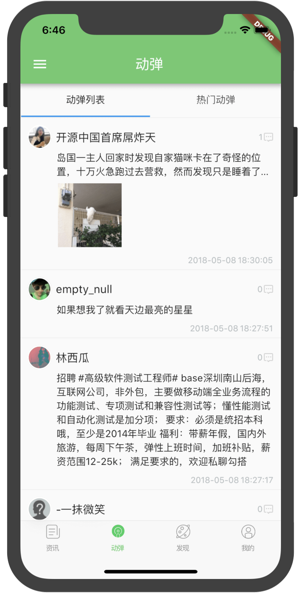
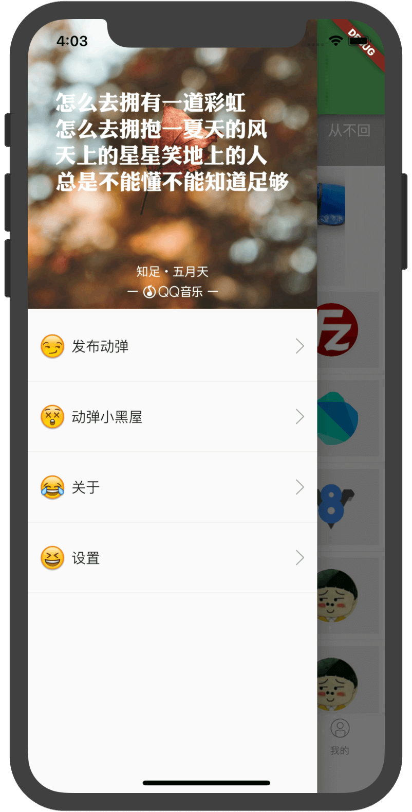
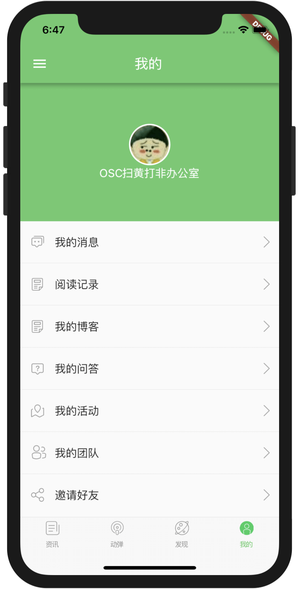
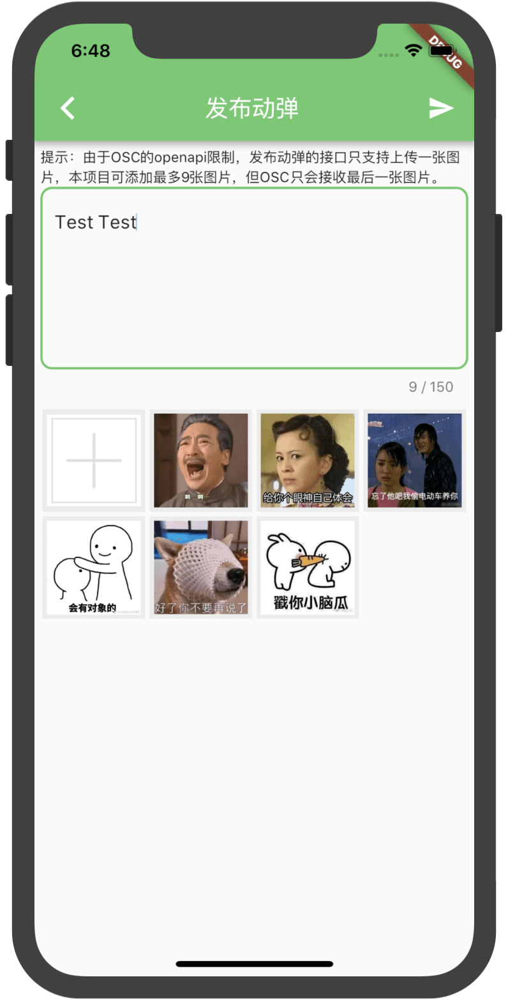
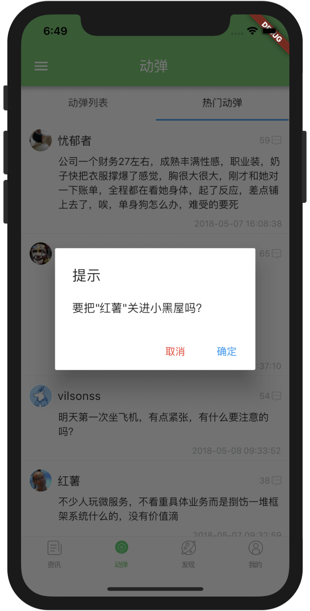
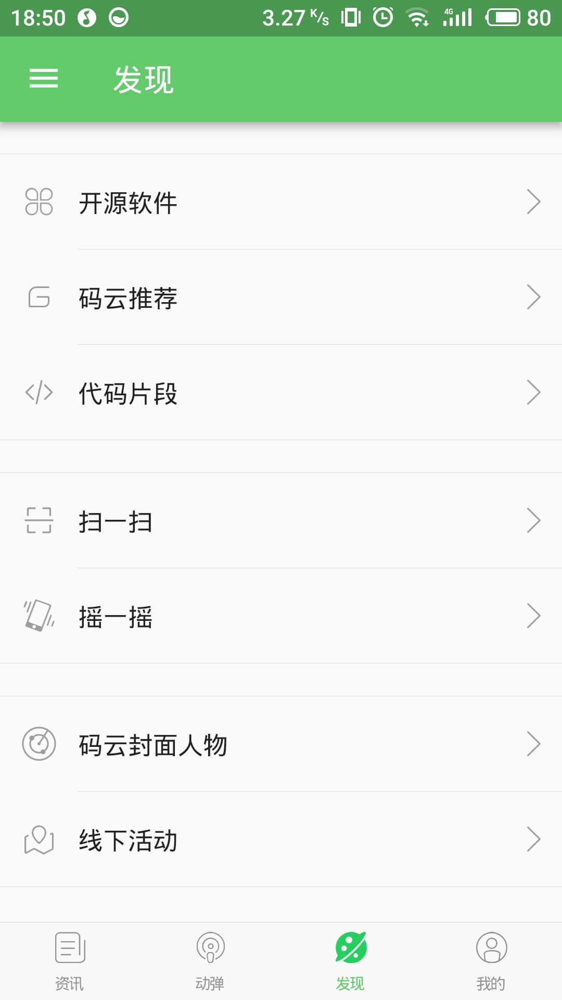
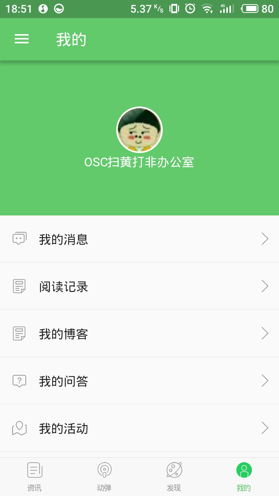
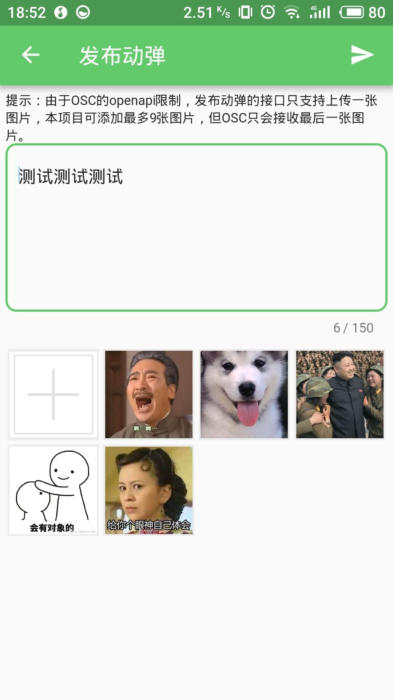
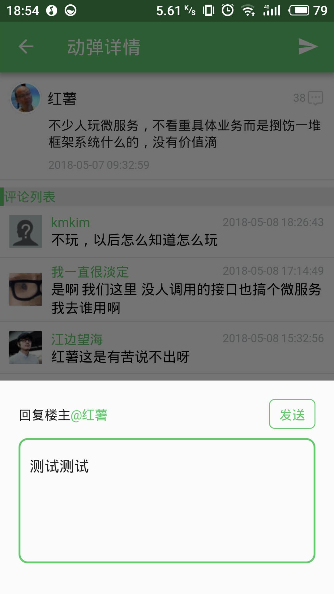

# FlutterOSC
- 基于Google Flutter的开源中国客户端，支持Android和iOS。
- [GitHub戳这里](https://github.com/yubo725/FlutterOSC) 
- [关于Google Flutter](https://flutterchina.club/)

# Android扫码下载APK
请使用手机浏览器扫码下载，不要使用微信或者qq扫码

# 功能
- [x] 登录（使用osc账号）
- [x] 查看资讯（未登录即可查看）
- [x] 查看、回复、发表、评论动弹（需要登录）
- [x] 动弹小黑屋（需要登录）
- [x] “发现”部分的功能基本上都是用H5实现
- [x] 资讯列表、动弹列表、评论列表支持下拉刷新或分页加载
- [ ] 动弹中的图片预览暂未实现
- [ ] 摇一摇、“我的”页面功能暂时没完成
- [ ] 主题切换功能暂未实现

# 说明
1. 由于开源中国的openapi只提供了基于webview或浏览器的oauth认证方式，故该项目登录界面使用webview加载OSChina三方认证页面，请放心使用开源中国的账号和密码登录
2. 受开源中国openapi的限制，获取动弹数据需要登录，由于openapi的资讯接口提供的数据比较简单，故资讯部分采用python爬取的网页数据
3. 本项目纯属个人兴趣爱好而写，不是开源中国官方版本，源代码仅供学习交流，实际使用请下载安装开源中国[官方APP](https://www.oschina.net/app)

# 截图
#### iOS

    
    
    

    
    
    

    
    
    

#### Android

    
    
    

    
    
    

    
    
    

