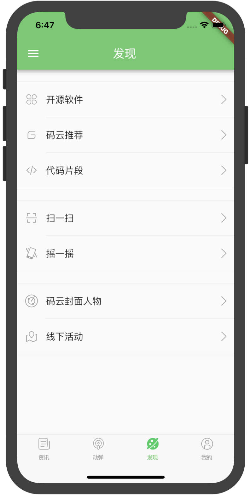

# FlutterOSC
基于Google Flutter的开源中国客户端，支持Android和iOS。[GitHub戳这里](https://github.com/yubo725/FlutterOSC) [关于Flutter](https://flutterchina.club/)

# Android扫码下载APK

# 说明
由于开源中国的openapi只提供了基于webview或浏览器的oauth认证方式，故该项目登录界面使用webview加载OSChina三方认证页面，请使用开源中国的账号和密码登录

# 截图
#### iOS

    
    
    

    
    
    

    
    
    

#### Android

    
    
    

    
    
    

    
    
    

